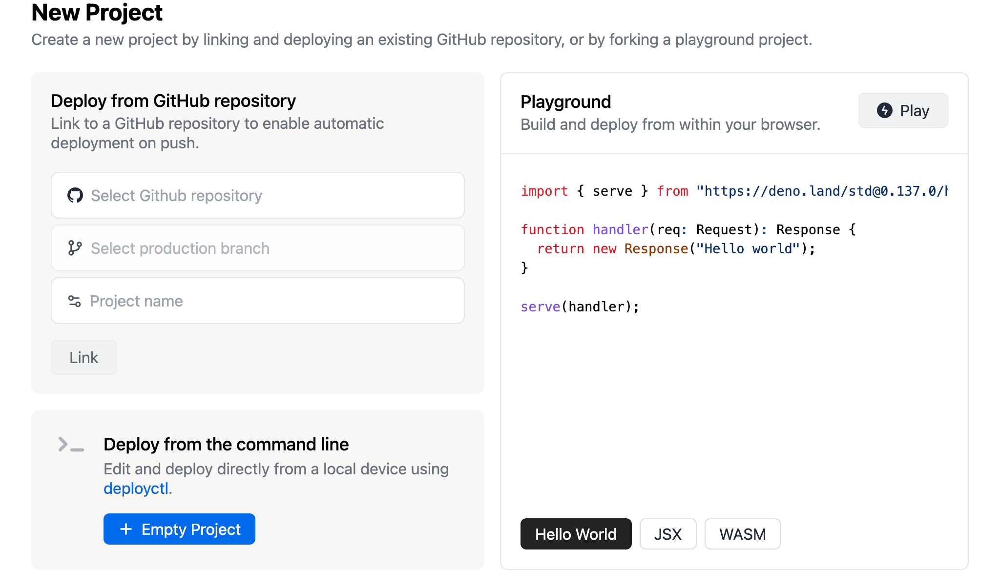
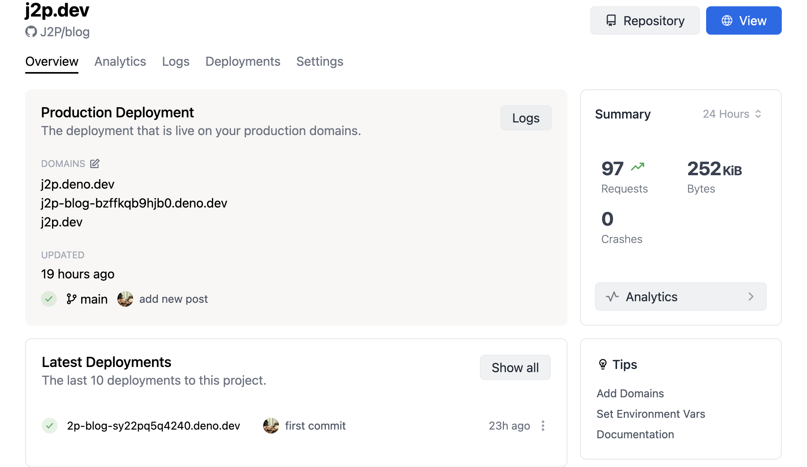

### Initialize

아래와 같이 명령어를 실행한다.

```bash
$ deno run https://deno.land/x/blog/init.ts [디렉토리 이름]
```

다음과 같은 구조로 블로그 디렉토리가 생성되고 블로그 작성을 위한 프로젝트가 생성된다.

```bash
.
|____posts
| |____hello_world.md
|____main.ts
|____deno.jsonc
```

`posts` 디렉토리에 마크다운 파일을 추가해서 포스트를 추가할 수 있다.

`main.ts` 파일에는 블로그에 대한 기본 설정을 할 수 있다.
아래와 같이 title, author, subtitle, header, style, middlewares 설정이 가능하다.
middlewares 에는 google analytics, redirects 설정이 가능하다.

``` js
{
  title: "My blog",
  author: "J2P",
  subtitle: 'My blog',
  header: "My blog",
  style: "body { padding: 32px 0; background-color: #f0f0f0; }",
  middlewares: [
    ga("UA-XXXXXXXX-X"),
    redirects({
     "/hello_world.html": "/hello_world",
    }),
  ]
}
```

`deno.jsonc` 파일에는 실행할 수 있는 기본 task 들이 있다.

```js
{
  "tasks": {
    "dev": "deno run --allow-net --allow-read --no-check --watch main.ts --dev",
    "serve": "deno run --allow-net --allow-read --no-check main.ts",
  }
}
```

### Run development server

아래와 같이 task 를 실행하면 개발환경의 서버가 실행된다.

```bash
$ deno task dev
```

실제로 실행되는 명령어는 `deno.jsonc` 파일에 있는 task 가 아래와 같이 실행이 된다.
```bash
$ deno run --allow-net --allow-read --no-check --watch main.ts --dev
Warning deno task is unstable and may drastically change in the future
Task dev deno run --allow-net --allow-read --no-check --watch main.ts --dev
Watcher Process started.
⚠️  ️Deno requests env access to "NODE_DEBUG". Run again with --allow-env to bypass this prompt.
   Allow? [y/n (y = yes allow, n = no deny)]
```

### Write post

`posts` 디렉토리에 마크다운으로 블로그 글을 작성한다.

```
---
title: "제목"
publish_date: "2022-05-30"
---

내용 입력
```

### Deploy with deno deploy

[deno deploy projects](https://dash.deno.com/projects) 페이지에서 `+ New Project` 버튼을 눌러서 새로운 프로젝트를 생성을 진행한다.

Github repository를 선택하고, branch 를 선택하고 project 이름을 작성하고 프로젝트를 생성한다.



프로젝트가 생성되면 자동으로 배포가 진행이 되고, 배포가 끝나면 프로젝트 Overview 페이지에 보이는 도메인으로 확인 가능하다.

